# 🎣 Lab: Phishing Triage Agent Walkthrough

> [!NOTE]
> **Unofficial — Educational use only.** This lab is part of the [securitycopilotindefender](../../) repository and is **not** official Microsoft documentation. For official guidance, see [Microsoft Security Copilot Phishing Triage Agent in Microsoft Defender](https://learn.microsoft.com/en-us/defender-xdr/phishing-triage-agent).

A self-paced, click-along walkthrough of the **Microsoft Security Copilot Phishing Triage Agent** in Microsoft Defender, mapped step-by-step to the public Zarmada demo at **[aka.ms/ptademo](https://aka.ms/ptademo)**.

> [!IMPORTANT]
> **The Phishing Triage Agent is being renamed to the Security Alert Triage Agent.** It's the same underlying agent, now extended to triage a broader set of Defender alerts beyond email — identity and cloud (containers) alert triage are currently in **Preview**. Email & collaboration (phishing) triage remains **Generally Available**. Existing configuration and feedback carry over automatically; no reinstall required. See [Security Alert Triage Agent (Preview)](https://learn.microsoft.com/en-us/defender-xdr/security-alert-triage-agent?tabs=email-alerts) and the FAQ entry [How does it differ from the Phishing Triage Agent?](https://learn.microsoft.com/en-us/defender-xdr/security-alert-triage-agent?tabs=email-alerts#what-is-the-security-alert-triage-agent-how-does-it-differ-from-the-phishing-triage-agent-and-how-do-i-onboard-if-im-already-using-the-agent-to-triage-phishing-alerts). Throughout this lab, references to *Phishing Triage Agent* match the Zarmada demo as recorded; in current production you may see the new name in the Microsoft Defender portal.

---

## 📋 Table of Contents
- [Overview](#-overview)
- [How the Agent Works](#-how-the-phishing-triage-agent-works)
- [Prerequisites & Permissions (Production)](#-prerequisites--permissions-production)
- [Launching the Demo](#-launching-the-demo)
- [Walkthrough](#-walkthrough)
  - [Step 1 — Introduction to the Agent](#step-1--introduction-to-the-phishing-triage-agent)
  - [Step 2 — Reviewing Incidents Handled by the Agent](#step-2--reviewing-incidents-handled-by-the-agent)
  - [Step 3 — Filtering the Queue by Resolved Status](#step-3--filtering-the-queue-by-resolved-status)
  - [Step 4 — Surfacing Real Phishing Attempts (Active Incidents)](#step-4--surfacing-real-phishing-attempts-active-incidents)
  - [Step 5 — Opening a Classified Incident](#step-5--opening-a-classified-incident)
  - [Step 6 — Reviewing the Agent's Reasoning](#step-6--reviewing-the-agents-reasoning)
  - [Step 7 — Viewing Agent Activity](#step-7--viewing-agent-activity)
  - [Step 8 — Exploring the Phishing Triage Agent Page](#step-8--exploring-the-phishing-triage-agent-page)
  - [Step 9 — Understanding the Decision Graph](#step-9--understanding-the-decision-graph)
  - [Step 10 — Inspecting Individual Decision Steps](#step-10--inspecting-individual-decision-steps)
  - [Step 11 — Reviewing Evidence and Response](#step-11--reviewing-evidence-and-response)
  - [Step 12 — Inspecting Email Clusters](#step-12--inspecting-email-clusters)
  - [Step 13 — Reviewing Cluster Remediation](#step-13--reviewing-cluster-remediation)
  - [Step 14 — Approving Final Remediation](#step-14--approving-final-remediation)
- [Additional Resources](#-additional-resources)

---

## 🧭 Overview

This walkthrough guides you through operating the Phishing Triage Agent (soon: **Security Alert Triage Agent**) in Microsoft Defender using Security Copilot for autonomous incident triage. The lab is delivered through the **Zarmada** platform, which captures the real Defender experience and replays it as a playable, click-along demo. Each step below maps directly to a screen in the Zarmada demo, with narration context, the action you'll take, and a screenshot of the highlighted UI element.

---

## ⚙️ How the Phishing Triage Agent Works

The agent is a [Security Copilot agent](https://learn.microsoft.com/en-us/copilot/security/agents-overview) embedded in Microsoft Defender. Per the official docs, it provides three key capabilities ([How the agent works](https://learn.microsoft.com/en-us/defender-xdr/phishing-triage-agent#how-the-agent-works)):

| Capability | What it does |
|---|---|
| 🤖 **Autonomous triage** | Uses AI-driven reasoning to determine whether a user-reported email is a real threat or a false alarm, without step-by-step human input. |
| 🔍 **Transparent rationale** | Records its verdict and the supporting evidence in natural language *and* a visual decision graph that analysts can audit. |
| 🧠 **Learning from feedback** | Analysts can correct classifications in plain language; approved feedback is stored as a *lesson* the agent applies to similar future alerts. |

Under the hood it combines **email content analysis**, **file and URL detonation**, **screenshot analysis**, **Microsoft Threat Intelligence**, and **advanced hunting** across Defender data sources to build its verdict.

**Verdicts you'll see in this walkthrough:**

- 🔴 **True Positive** — Confirmed malicious. Incident remains *Active* for analyst response.
- 🟢 **False Positive** — Benign / false alarm. Agent resolves the incident automatically.
- 🏷️ **Agent tag** — Added to every incident the agent triages so you can filter the queue to just agent-handled items.

---

## 🔐 Prerequisites & Permissions (Production)

This demo is read-only, but in production the agent requires the following before it can run. Verify these in your tenant before deploying ([full prerequisites](https://learn.microsoft.com/en-us/defender-xdr/phishing-triage-agent#prerequisites)):

- **Licensing** — Security Copilot with provisioned [SCU capacity](https://learn.microsoft.com/en-us/copilot/security/manage-usage) + Microsoft Defender for Office 365 Plan 2.
- **Unified RBAC** — [Activate the Defender for Office 365 workload](https://learn.microsoft.com/en-us/defender-xdr/activate-defender-rbac#activate-in-microsoft-defender-xdr-settings) in Defender XDR unified RBAC.
- **User-reported settings** — Enable *Monitor reported messages in Outlook* and configure a reported-message destination — see [Configure user reported settings](https://learn.microsoft.com/en-us/defender-office-365/submissions-user-reported-messages-custom-mailbox).
- **Alert policy** — Ensure the **Email reported by user as malware or phish** alert policy is enabled, and **disable the Auto-Resolve tuning rule** for that alert (the agent doesn't triage alerts that tuning has already resolved). See [Alert policies](https://learn.microsoft.com/en-us/defender-xdr/alert-policies).
- **Agent identity** — Recommended option is a new Microsoft Entra **Agent ID** with a least-privilege role. Required permissions: *Security Copilot (read)*, *Security data basics (read)*, *Alerts (manage)*, *Email & collaboration metadata (read)*, *Email & collaboration content (read)* — see [required permissions](https://learn.microsoft.com/en-us/defender-xdr/phishing-triage-agent#phishing-triage-agent-required-permissions).
- **Reviewer permissions** — Ensure analysts who oversee the agent have **equal or higher** permissions than the agent identity.

For the full deployment walkthrough, see [Set up the Phishing Triage Agent](https://learn.microsoft.com/en-us/defender-xdr/phishing-triage-agent#set-up-the-phishing-triage-agent).

> [!TIP]
> Already running the Phishing Triage Agent and want the expanded identity/cloud triage? You don't need to install a new agent — just review the new prerequisites and toggle the additional alert types in agent settings. See [the rename FAQ](https://learn.microsoft.com/en-us/defender-xdr/security-alert-triage-agent?tabs=email-alerts#what-is-the-security-alert-triage-agent-how-does-it-differ-from-the-phishing-triage-agent-and-how-do-i-onboard-if-im-already-using-the-agent-to-triage-phishing-alerts).

---

## 🚀 Launching the Demo

The demo is **public and shareable** at **[aka.ms/ptademo](https://aka.ms/ptademo)** — send it to customers, partners, or colleagues who want to try it on their own. Open the link and click **Start** to begin. The Zarmada player replays the Defender environment exactly as a SOC analyst would see it.

> [!TIP]
> **How to click through the demo.** At each step, look for the **blinking yellow beacon** on screen — that's the exact spot you need to click to advance. For example, in the screenshot below the *Incidents addressed by agent* card is pulsing yellow, so that's what you'd click next. Every step's screenshot in this guide shows the highlighted area to click for that step.
>
> 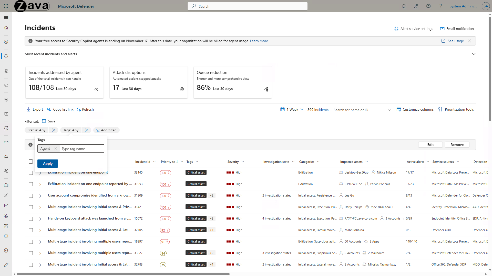

---

## 🧪 Walkthrough

### Step 1 — Introduction to the Phishing Triage Agent

**Objective:** Understand the problem the agent solves and where it lives.

**Context:** Every day, users report hundreds of suspicious email messages to the security team — most turn out to be spam. At Zava, this flood of reports overwhelms analysts and pulls focus away from real attacks. The Phishing Triage Agent autonomously triages these user-reported phishing alerts, classifies incidents, and adapts to feedback — reducing alert fatigue and improving SOC efficiency.

**Action:** On the Defender home page, select the **Incidents addressed by this agent** card.

**Learn more:**
- [Phishing Triage Agent (official reference)](https://learn.microsoft.com/en-us/defender-xdr/phishing-triage-agent)
- [Security Alert Triage Agent (Preview — the new name)](https://learn.microsoft.com/en-us/defender-xdr/security-alert-triage-agent?tabs=email-alerts)
- [How the agent works](https://learn.microsoft.com/en-us/defender-xdr/phishing-triage-agent#how-the-agent-works)

---

### Step 2 — Reviewing Incidents Handled by the Agent

**Objective:** See the agent's footprint in your queue.

**Context:** The agent card above the incident queue surfaces two headline metrics — *Incidents addressed* (incidents containing alerts the agent classified as either a true threat or a false alarm) and *Incidents resolved* (incidents the agent closed as false alarms). Microsoft calculates these from the agent's first recorded incident or the last 30 days, whichever is more recent. See [Monitor and manage the Phishing Triage Agent](https://learn.microsoft.com/en-us/defender-xdr/phishing-triage-agent#monitor-and-manage-the-phishing-triage-agent).

**Action:** Select the **Incidents addressed by this agent** card again to drill in.

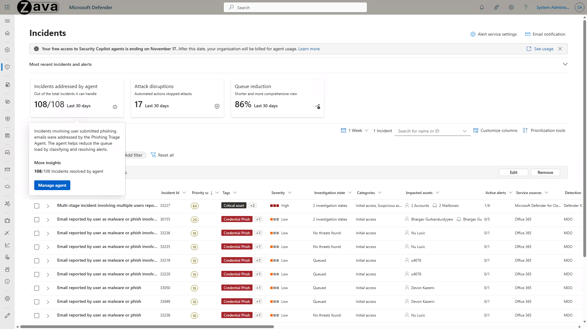

---

### Step 3 — Filtering the Queue by Resolved Status

**Objective:** Find the incidents the agent has already triaged.

**Context:** When the agent determines an alert is a false alarm, it classifies it as **False Positive** and resolves the corresponding incident automatically, so analysts don't have to revisit it. The agent also tags every incident it processes with the *Agent* tag, which you can use as an alternative filter (or filter on the **agent identity name** to see what the agent is currently working on). See [Collaborate with the agent](https://learn.microsoft.com/en-us/defender-xdr/phishing-triage-agent#collaborate-with-the-agent).

**Action:**
1. Select the **Status: any** filter at the top of the incident list.
2. Select **Resolved**.
3. Select **Apply**.

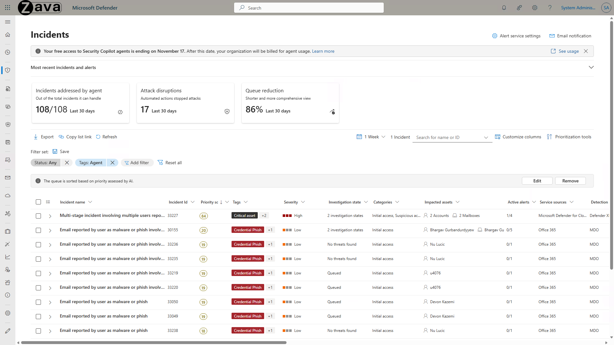

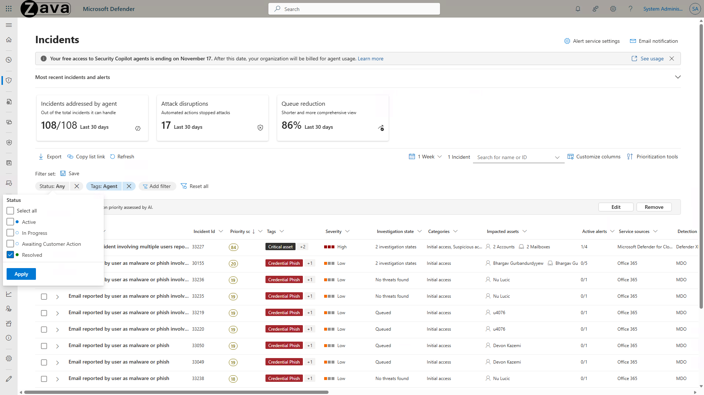

---

### Step 4 — Surfacing Real Phishing Attempts (Active Incidents)

**Objective:** Pivot from benign alerts to the incidents that need analyst attention.

**Context:** When the agent classifies an alert as malicious it sets the verdict to **True Positive** and leaves the incident *Active* and in progress so a human analyst can take response actions. Filtering on **Active** is how you triage *just* the threats the agent surfaced as real.

**Action:**
1. Select the **Status: resolved** filter.
2. Select **Active**.
3. Select **Apply**.

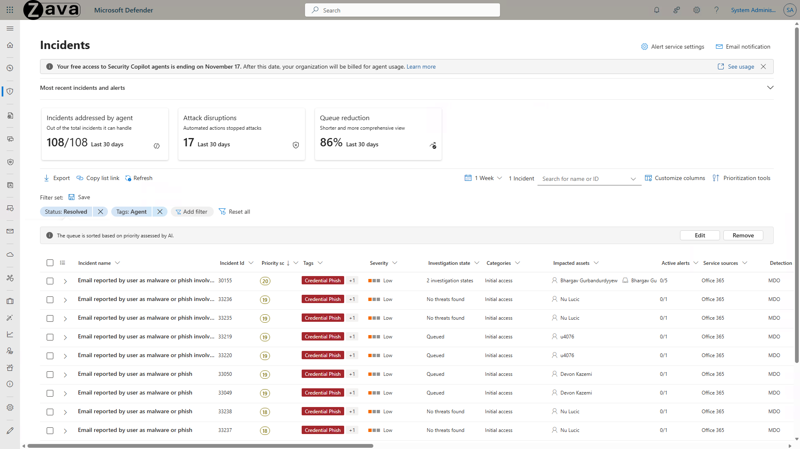

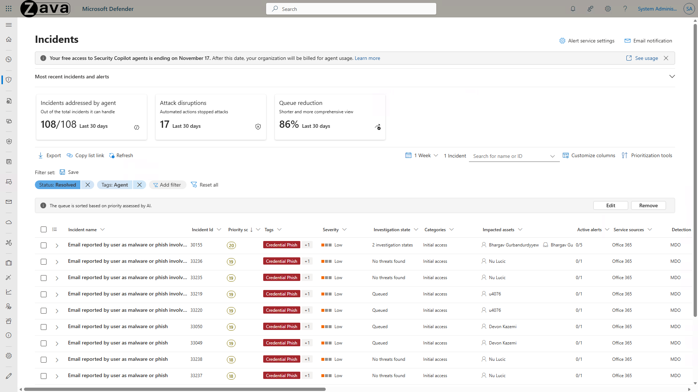

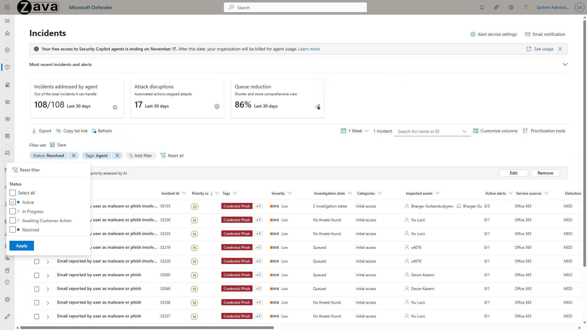

---

### Step 5 — Opening a Classified Incident

**Objective:** Explore one of the incidents the agent flagged as malicious.

**Action:** Select the **first incident** in the list.

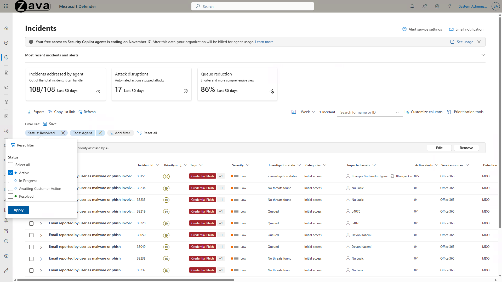

---

### Step 6 — Reviewing the Agent's Reasoning

**Objective:** Read the agent's natural-language verdict and reasoning.

**Context:** Look for the **Phishing Triage Agent card** in the Copilot or Tasks side panel under *Guided Response Triage*. The card shows the verdict, key incriminating evidence, and a *See more* link to the full natural-language explanation. From the *More actions* (`...`) menu on the card you can also view alert details, copy the classification details, or manage feedback. See [Transparency and explainability in phishing triage](https://learn.microsoft.com/en-us/defender-xdr/phishing-triage-agent#transparency-and-explainability-in-phishing-triage).

**Action:** In the Security Copilot summary card, select **See more** to expand the full explanation.

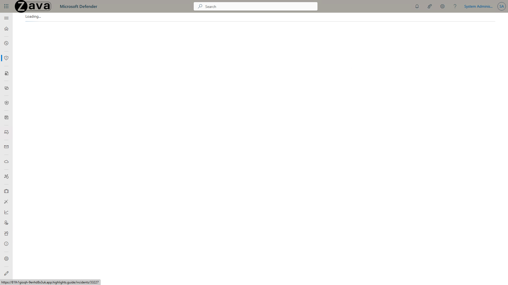

---

### Step 7 — Viewing Agent Activity

**Objective:** Open the activity pane to see what the agent did and how long it took.

**Context:** *View agent activity* exposes the step-by-step logic the agent followed before reaching its classification — the same content surfaced as a visual decision graph in Step 9. This is the analyst's audit trail for trusting the verdict.

**Action:** Select **View agent activity**.

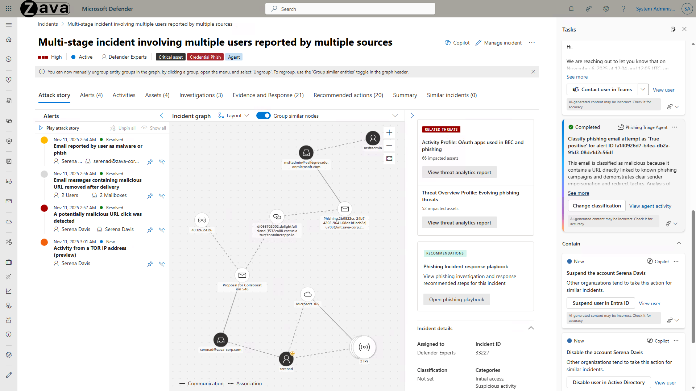

---

### Step 8 — Exploring the Phishing Triage Agent Page

**Objective:** Drill into the agent itself to review its overall behavior.

**Context:** The agent page has two tabs: **Overview** (current status, identity, role, and recent activity) and **Performance** (daily activity, mean time to triage (MTTT), and SCU consumption). From the ellipsis (`...`) at the top right you can **Pause** or **Run** the agent, edit settings, view feedback, or remove the agent. See [Monitor and manage the Phishing Triage Agent](https://learn.microsoft.com/en-us/defender-xdr/phishing-triage-agent#monitor-and-manage-the-phishing-triage-agent).

**Action:** Select the agent name link — **Phishing Triage Agent**.

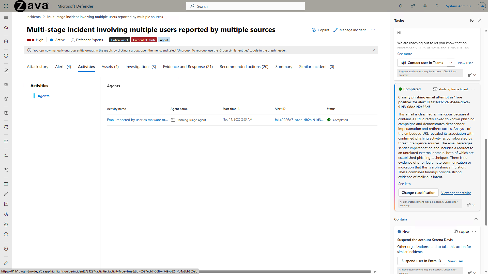

---

### Step 9 — Understanding the Decision Graph

**Objective:** See a visual map of how the agent reached its conclusion.

**Context:** The agent visualizes its reasoning as an intuitive decision graph, with each node representing an evaluation step (e.g., sender reputation, URL detonation, screenshot analysis, threat-intel lookup). All of the agent's decisions, reasoning, and actions are also recorded in Microsoft Purview audit logs for traceability.

**Action:** Select the **diagram**.

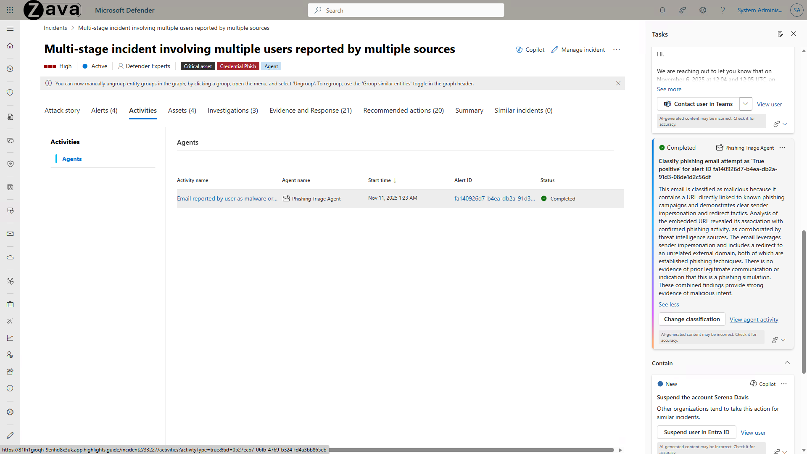

**Learn more:**
- [Transparency and explainability](https://learn.microsoft.com/en-us/defender-xdr/phishing-triage-agent#transparency-and-explainability-in-phishing-triage)
- [Investigate incidents in Microsoft Defender](https://learn.microsoft.com/en-us/microsoft-365/security/defender-endpoint/investigate-incidents)

---

### Step 10 — Inspecting Individual Decision Steps

**Objective:** Drill into a node to see the agent's thinking at that point.

**Context:** The cards in the graph are clickable — open any one to see what the agent was evaluating and the evidence behind that step.

**Action:** Explore the cards, then select the **X** in the top-right to close the graph view.

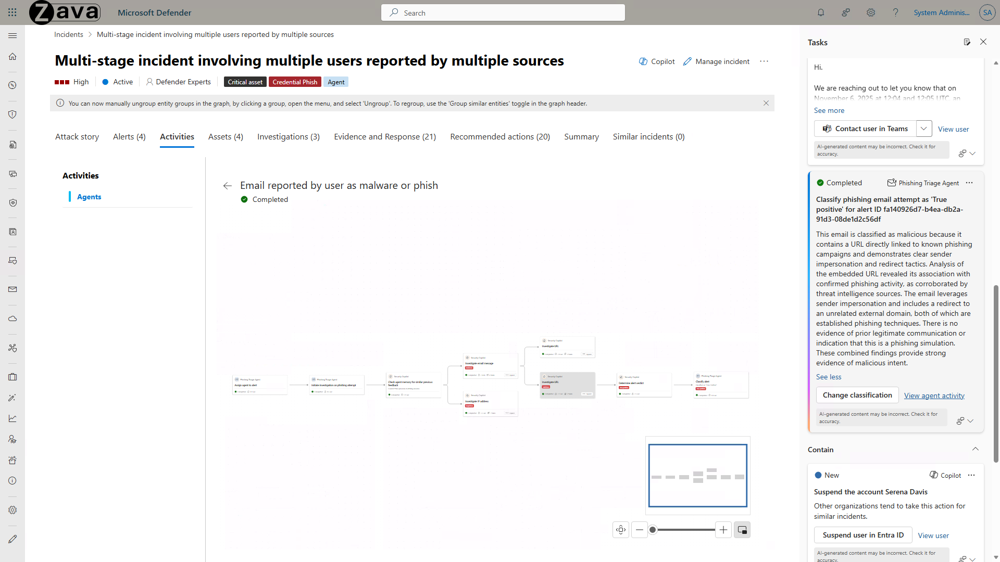

> [!TIP]
> **Overriding the verdict (teaching the agent).** If you disagree with the agent's classification, choose **Change classification** on the agent card (or **Manage alert** on the alert), pick the new classification (**True Positive** = phishing, **False Positive** = not malicious), and fill out *Why did you change this classification*. By default this is recorded for audit only. To actually teach the agent, also select **Use this feedback to teach the agent**, then **Evaluate feedback** to preview the *lesson* the agent will store. Feedback must be relevant, specific, decisive, and consistent with prior feedback — review the [Best practices for writing feedback](https://learn.microsoft.com/en-us/defender-xdr/phishing-triage-agent#best-practices-for-writing-feedback) and [Resolve feedback failures](https://learn.microsoft.com/en-us/defender-xdr/phishing-triage-agent#resolve-feedback-failures). Approved lessons are visible (and rejectable, with Security Administrator) on the **Agent feedback** page.

---

### Step 11 — Reviewing Evidence and Response

**Objective:** Confirm what Defender remediated automatically.

**Context:** The agent itself only classifies — it does **not** delete mail or invoke response actions. Remediation (such as soft-deleting malicious mail across affected mailboxes) is performed by Microsoft Defender for Office 365's automated investigation and response, and is surfaced for analyst review on the *Evidence and Response* tab.

**Action:** Select the **Evidence and Response** tab.

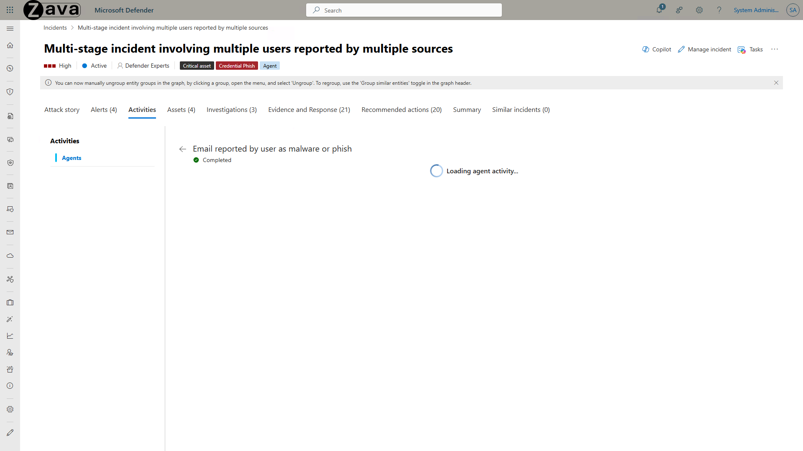

---

### Step 12 — Inspecting Email Clusters

**Objective:** See how Defender grouped related malicious mail across your tenant.

**Action:** Select **Email clusters**.

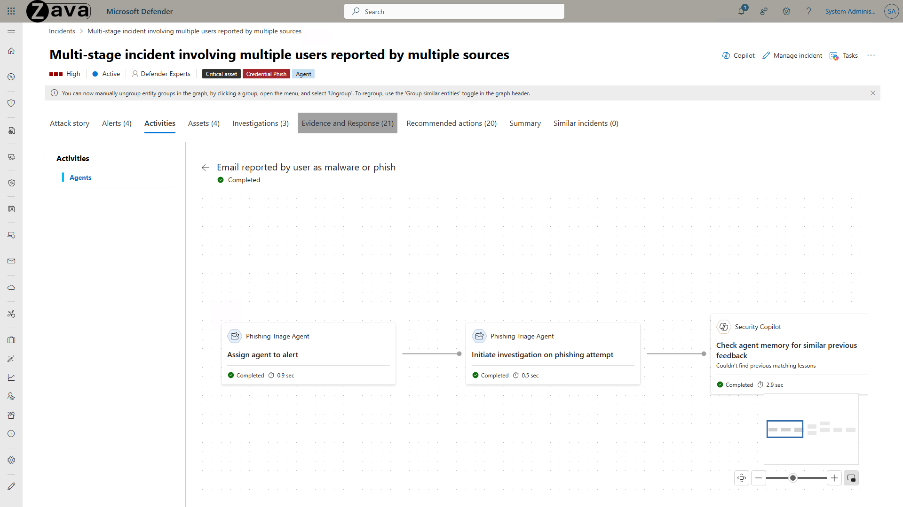

---

### Step 13 — Reviewing Cluster Remediation

**Objective:** Understand the scope of the cleanup.

**Context:** The agent identified similar malicious emails across your organization, prevented them from entering inboxes, and soft-deleted any that had already landed.

**Action:** Select the **third email cluster** to inspect its detail.

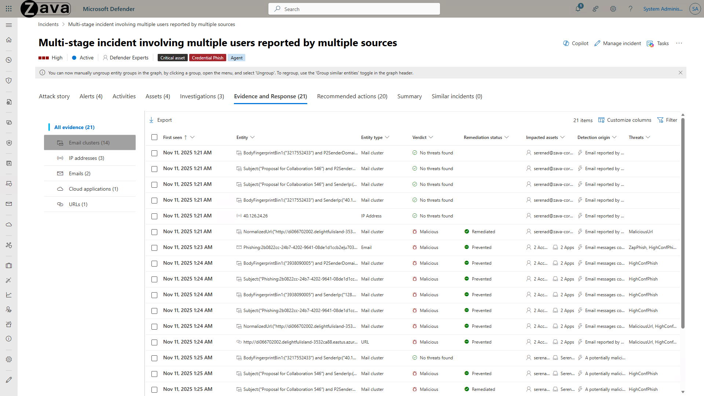

---

### Step 14 — Approving Final Remediation

**Objective:** Close the loop with a final approved action.

**Context:** The agent suggests a final remediation action — all you have to do is approve it. This is how the agent helps you cut through the noise so you can focus on stopping real attacks. Just as important, every approval, override, and feedback submission becomes part of the agent's audit trail and (when you opt in) part of the lessons that tune future verdicts.

> [!NOTE]
> **Why it matters.** In a recent experiment, analysts working with the Phishing Triage Agent caught **up to 6.5× more malicious emails** than graders working without it — clear evidence that autonomous intelligence supercharges human productivity.

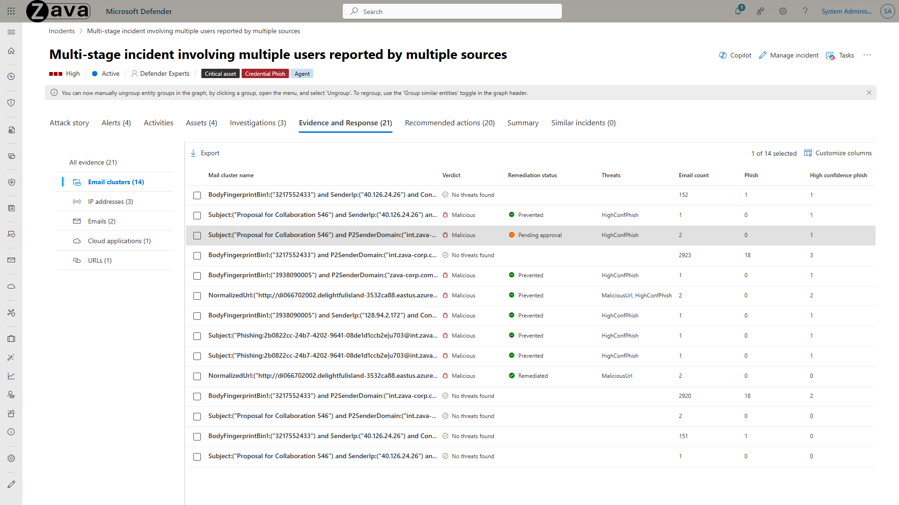

**🏁 End of demo.**

---

## 📚 Additional Resources

**Official Microsoft Learn docs**

- 📘 [Phishing Triage Agent (official)](https://learn.microsoft.com/en-us/defender-xdr/phishing-triage-agent)
- 📘 [Security Alert Triage Agent — new name / expanded scope (Preview)](https://learn.microsoft.com/en-us/defender-xdr/security-alert-triage-agent?tabs=email-alerts)
- [How the agent works](https://learn.microsoft.com/en-us/defender-xdr/phishing-triage-agent#how-the-agent-works)
- [Prerequisites](https://learn.microsoft.com/en-us/defender-xdr/phishing-triage-agent#prerequisites)
- [Permissions required](https://learn.microsoft.com/en-us/defender-xdr/phishing-triage-agent#permissions-required)
- [Set up the agent (deployment walkthrough)](https://learn.microsoft.com/en-us/defender-xdr/phishing-triage-agent#set-up-the-phishing-triage-agent)
- [Transparency and explainability](https://learn.microsoft.com/en-us/defender-xdr/phishing-triage-agent#transparency-and-explainability-in-phishing-triage)
- [Teach the agent through feedback](https://learn.microsoft.com/en-us/defender-xdr/phishing-triage-agent#teach-the-agent-your-organizations-context-through-feedback)
- [Best practices for writing feedback](https://learn.microsoft.com/en-us/defender-xdr/phishing-triage-agent#best-practices-for-writing-feedback)

**Adjacent**

- [Microsoft Security Copilot agents (overview)](https://learn.microsoft.com/en-us/copilot/security/agents-overview)
- [Responsible AI FAQs for Security Copilot agents](https://learn.microsoft.com/en-us/copilot/security/rai-faqs-security-copilot-agents)
- [Investigate incidents in Defender](https://learn.microsoft.com/en-us/microsoft-365/security/defender-endpoint/investigate-incidents)
- [Security Copilot agents learning module](https://learn.microsoft.com/en-us/training/modules/security-copilot-describe-agents/5-describe-phishing-triage-agent)
- [Troubleshoot Security Copilot Conditional Access policies](https://learn.microsoft.com/en-us/entra/identity/conditional-access/troubleshoot-security-copilot-policies)
- [Manage Security Compute Unit (SCU) capacity](https://learn.microsoft.com/en-us/copilot/security/manage-usage)

**Related in this repo**

- 🔧 [Diagnose & remediate Phishing Triage Agent tag stripping](../../scripts/Diagnose-And-Remediate-PhishingTriageAgentTags.ps1)
- 📂 [All labs](../) · [Back to repository root](../../)

---

> [!WARNING]
> **Unofficial — Educational use only.** This lab is community-authored and is **not** affiliated with, endorsed by, or representative of Microsoft. For official product documentation, always refer to [learn.microsoft.com](https://learn.microsoft.com/). See the [repository disclaimer](../../#%EF%B8%8F-disclaimer) for full terms.
